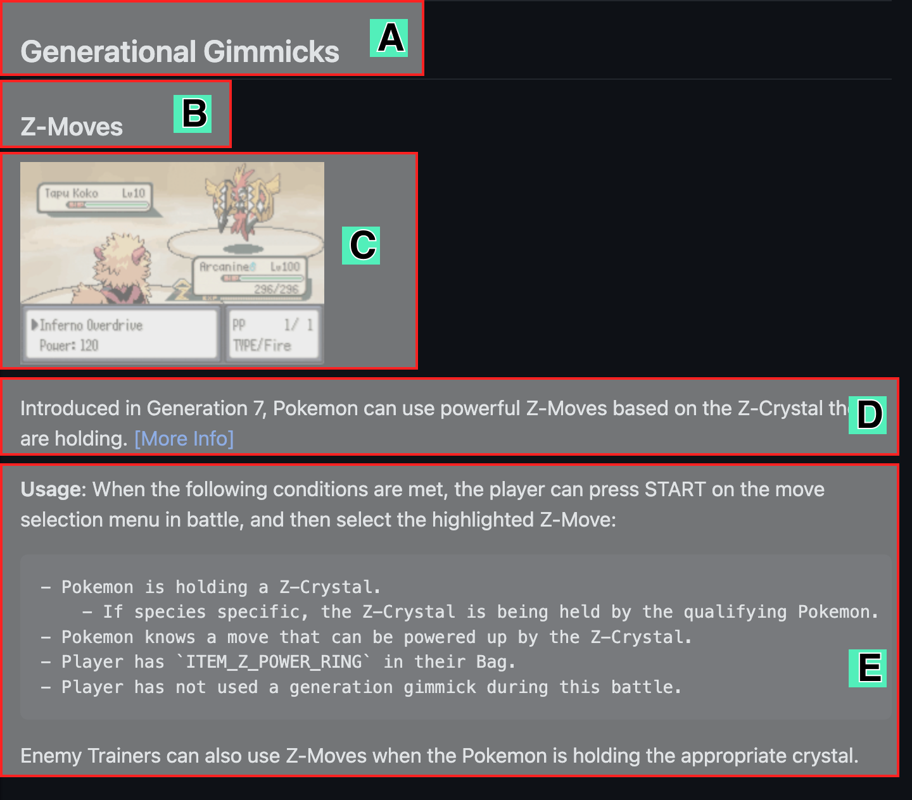

# Manual
[`pokeemerald-expansion`](https://github.com/rh-hideout/pokeemerald-expansion/) is a fork of pret's decompilation project, [`pokeemerald`](https://github.com/pret/pokeemerald). This fork has several goals:

- Allow fangame developers that are using `pokeemerald` as a base to quickly and easily use key features from [main series](https://bulbapedia.bulbagarden.net/wiki/Core_series) Pokémon games.
- Reduce the barrier of entry for fangame developers to get into decomplilation development.
- Provide fangame developers a collection of optional quality of life (QoL) improvements to improve developer and player experience.

`pokeemerald-expansion` is a collection of different features, fixes and modifications from [hundreds of different developers](credits.md), artists and players to help make a comprensive experience.

This manual's goal is to detail all of the features available to developers that have chosen to use `pokeemerald-expansion`, and provide guidance on how to use them in their projects.

---

## Table of Contents

### Configurations

- [Battle](configurations/battle.md)
- [Debug](configurations/debug.md)
- [General](configurations/general.md)
- [Item](configurations/item.md)
- [Overview](configurations/index.md)
- [Overworld](configurations/overworld.md)
- [Pokemon](configurations/pokemon.md)

### Developer Features

- [Battle Debug Menu](developer_features/battleDebugMenu.md)
- [Custom Battle Scripts](developer_features/customBattleScripts.md)
- [Debug Menu](developer_features/debugMenu.md)
- [Trainer Control](developer_features/trainerControl.md)

### Game Features

- [Abilities and Types](game_features/abiltiesandtypes.md)
- [Battle Slide](game_features/battle_slide.md)
- [Expanded Doubles](game_features/expanded_doubles.md)
- [Generation Gimmicks](game_features/generation_gimmicks.md)
- [Improved AI](game_features/improved_ai.md)
- [Items](game_features/items.md)
- [Moves](game_features/moves.md)
- [Pokemon](game_features/pokemon.md)
- [Totem Boosts](game_features/totemBoosts.md)
- [Trainer Messages](game_features/trainer_message.md)

---

## Reading This Manual
All of the features in this document are roughly organized by category, and then are shown as follows:

A. **Category**: The group of feature that this feature belongs with.

B. **Feature Name**

C. **Gif or image of feature**: A gif showing the video in action.

D. **Feature Description**: A short description of how the feature works.

E. **How to use**: How the developer can enable, configure, or use this feature.

## Frequently Asked Questions (FAQ)

### Who maintains the project?

The project was originally started by DizzyEgg alongside other contributors.

The project has now gotten larger and DizzyEgg is now maintaining the project as part of the ROM Hacking Hideout community. Some members of this community are taking on larger roles to help maintain the project.

Check out our [credits page](credits.md)!

### Can I contribute even if I'm not a member of ROM Hacking Hideout?

Yes! Contributions are welcome via Pull Requests and they will be reviewed by maintainers. Please note that PRs to master are not accepted, as master is only intended to be a merged branch. Please open PRs against upcoming.

### What is ROM Hacking Hideout?

A Discord-based ROM hacking community that has many members who hack using the disassembly and decompilation projects for Pokémon. Quite a few contributors to the original feature branches by DizzyEgg were members of ROM Hacking Hideout. You can call it RHH for short!

[Click here to join the RHH Discord Server!](https://discord.gg/6CzjAG6GZk)

---

## Version

This document is accurate as of Version 1.4.2 (Mar 29 2023), and will be updated as new features as added.
